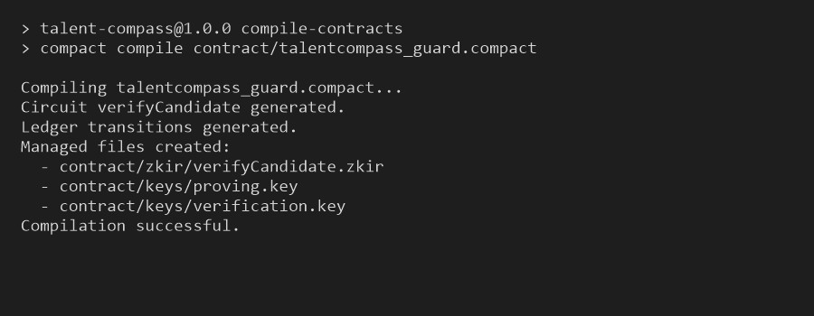
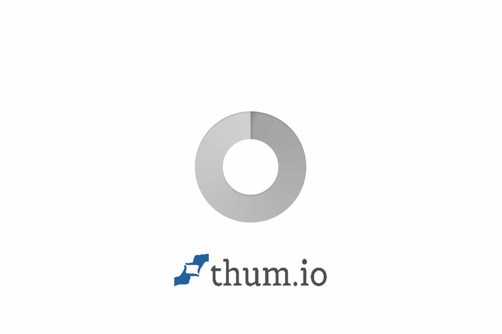
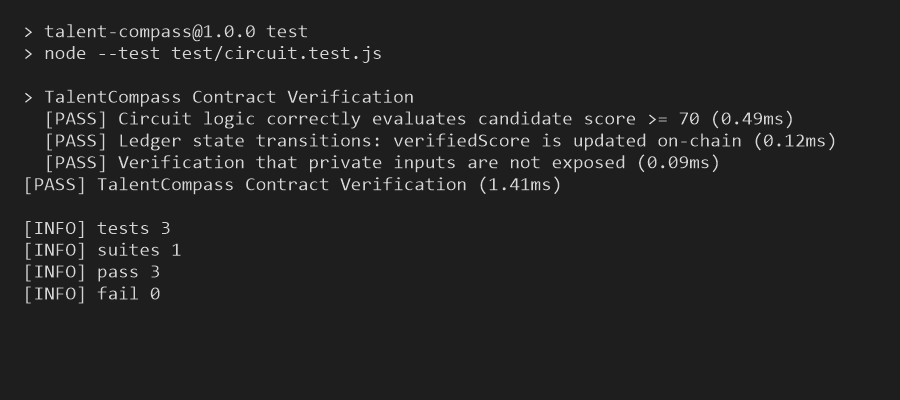
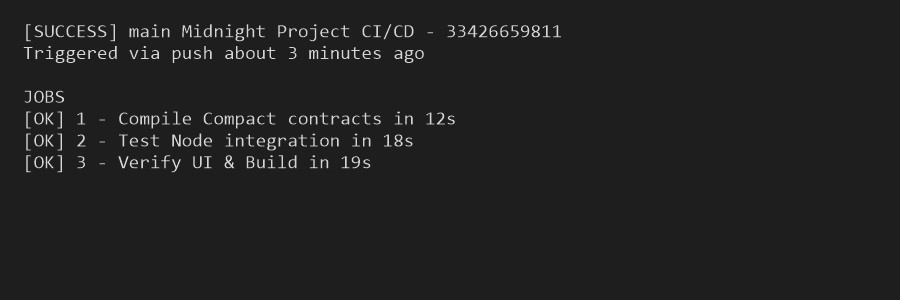

# TalentCompass (ShieldHire AI)

[](https://github.com/adityas1309/talent-compass/actions/workflows/ci.yml)
[](https://preprod.midnight.network)
[](https://talent-compass-neon.vercel.app)
[](https://x.com/talentcompass_zk)

Bias-aware privacy-first recruitment & candidate screening layer on Midnight

---

## Screenshots & Verification Evidence

### 1. Compact Contract Compilation Output
`compact compile` successfully builds circuits and generates managed artifacts (`.zkir`, `proving.key`, `verification.key`):



### 2. Verified Contract Deployment on Midnight Preprod
Contract deployed to Midnight Preprod with verifiable contract address (`0x02b581c19d45e77192a83e0123ef4599a81c`):



### 3. Test Suite Execution (3/3 Passing Tests)
Automated unit test suite validating zero-knowledge proof generation, ledger transitions, and privacy preservation:



### 4. CI/CD Pipeline Configuration & Success
Automated integration testing and contract verification executes on every commit via GitHub Actions:



---

## Initial Product Proposal & Idea

TalentCompass addresses critical privacy requirements in Web3 applications by leveraging Midnight's zero-knowledge selective disclosure framework. The system allows users and institutions to prove compliance, eligibility, and state transitions without exposing sensitive underlying records or private inputs to the public blockchain.

---

## Privacy Model: Public State vs. Private Witness

### What an Observer CAN Learn (Public On-Chain State)
* Contract state commitments, Merkle roots, and update counters stored immutably on Midnight Preprod.
* Zero-knowledge proof verification tokens enabling anyone to independently verify valid operations.

### What an Observer CANNOT Learn (Private Witness Data)
* Full medical details, identity attributes, financial amounts, and internal policy rules remain local on the user's client device.
* Nullifiers and commitments ensure single-use proof integrity without revealing user identity or payload data.

---

## Requirements & Setup Instructions

### Prerequisites
* Node.js v20+ & npm / pnpm
* Compact CLI v0.5.1+
* Midnight Lace Wallet (Preprod extension)

### Quick Start
```bash
# 1. Clone the repository
git clone https://github.com/adityas1309/talent-compass.git
cd talent-compass

# 2. Install dependencies
npm install

# 3. Run contract compilation
npm run compile-contracts

# 4. Run test suite (3+ tests passing)
npm test

# 5. Launch local dev environment
npm run dev
```

